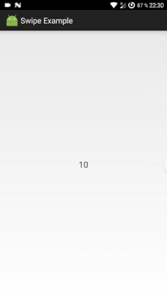

# SwipeActions
An Android library providing easy swipe actions for a single view.

# Demo preview


# Description
This class provides two animated swipe actions for child view - left and right.
Actions' logos may be changed via XML attributes.
The code is based on [SwipeRefreshLayout](https://android.googlesource.com/platform/frameworks/support/+/f25dedc/v4/java/android/support/v4/widget/SwipeRefreshLayout.java) from v4 support package and adapted to support two CircleImageView instances.  

The library is used in various Android applications by [Chess King](http://play.google.com/store/apps/dev?id=8196632901699712832).

# Setup
- Project's minimum supported version is 9 (tested only on 9+ project, may be reduced to 4).
- Wrap your UI element inside `com.raistlin.swipeactions.SwipeActionsLayout`. **Warning:** ensure your view is clickable, set `android:clickable="true"` otherwise.
    ```
    <com.raistlin.swipeactions.SwipeActionsLayout
        android:id="@+id/activity_actions_layout"
        android:layout_width="match_parent"
        android:layout_height="match_parent"
        app:left_image="@drawable/ic_action_arrow_back"
        app:right_image="@drawable/ic_action_arrow_forward">

        <TextView
            android:id="@+id/activity_actions_view"
            android:layout_width="wrap_content"
            android:layout_height="wrap_content"
            android:clickable="true"
            android:gravity="center"
            android:textSize="20sp" />

    </com.raistlin.swipeactions.SwipeActionsLayout>
    ```
- Find view from code and set `SwipeActionsLayout.ActionsListener`
    ```
    SwipeActionsLayout layout = (SwipeActionsLayout) findViewById(R.id.activity_actions_layout);
    layout.setActionsListener(new SwipeActionsLayout.ActionsListener() {
        @Override
        public void onActionSelected(SwipeDirection direction) {

        }
    });
    ```
- All done! Give it a try!

# Comments
Your feedback and pull requests are appreciated. Thanks!
